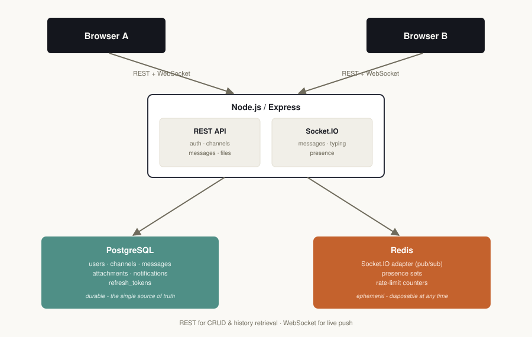

# Team Chat


A real-time team collaboration / chat app: WebSocket messaging, Redis-backed
presence and rate limiting, PostgreSQL storage, JWT auth, notifications, and
file sharing. Built to actually run - [`CHECKLIST.md`](CHECKLIST.md) is a
two-minute check that messages arrive in a second browser window with no
refresh, plus an automated test suite that exercises the real stack.

For how it's built and why (data flow, event/API reference, trade-offs), see
[`ARCHITECTURE.md`](ARCHITECTURE.md).



## Features

- [x] WebSocket messaging (Socket.IO) - text and file messages, delivered live
- [x] Redis - Socket.IO adapter (cross-instance broadcast), presence, rate-limit storage
- [x] PostgreSQL - users, channels, messages, attachments, notifications
- [x] JWT auth - short-lived access tokens + DB-backed, revocable refresh tokens
- [x] Presence / online-offline status - correct across multiple tabs/devices per user
- [x] Typing indicators
- [x] Notifications - live push if online, persisted for later if not
- [x] File sharing - upload, then attach to a message
- [x] Message history - cursor-paginated
- [x] Rate limiting - login, message send, uploads, and a general baseline

## What this project demonstrates

A few specific decisions, for anyone reviewing the code rather than just
running it:

- **Atomic presence transitions, with a debounce on top.** Online/offline
  detection uses small Lua scripts, not a check-then-set from application
  code, so two tabs connecting in the same millisecond can't both fire a
  duplicate "online" event. Going offline is additionally delayed a few
  seconds and re-checked against the live socket set before broadcasting,
  so a brief drop-and-reconnect doesn't flicker a user's status for
  everyone watching it.
- **Written as if it always runs on more than one instance**, even though
  the bundled Docker Compose setup only runs one. Presence broadcasts,
  the "is this recipient already looking at the channel" check for
  notifications, and Socket.IO's own room broadcasts all go through the
  Redis adapter or a Redis pub/sub channel rather than in-memory state.
- **A real race condition, found by testing, not by reading the code.**
  Socket event listeners are registered *before* the async room-join/
  presence setup that reads more naturally coming first - otherwise a
  message sent immediately on connect can be silently dropped. Detailed in
  [`ARCHITECTURE.md`](ARCHITECTURE.md#real-time-message-flow).
- **Revocable auth, not just stateless JWT.** Refresh tokens are stored
  hashed in Postgres, so logout actually invalidates a session rather than
  just deleting a token client-side.
- **Sockets re-authenticate, not just connect once.** An access token is
  normally checked only at handshake and trusted for the life of the
  connection. Here each socket carries a timer tied to the token's real
  expiry and must present a fresh one before it fires, or it's
  disconnected. The *client's* refresh is scheduled from that same expiry
  rather than a fixed interval, so the mechanism holds at any configured
  token lifetime instead of only the default 15 minutes - see
  [`ARCHITECTURE.md`](ARCHITECTURE.md#socket-auth-lifecycle).
- **Attachments are claimed, not trusted.** `message:send` never takes a
  client-supplied file name/URL/MIME type at face value - it atomically
  claims a row in an `uploads` table that only exists if this exact user
  actually uploaded that file and hasn't already attached it elsewhere.
  Closes a real gap: without this, any authenticated user could fabricate
  an attachment pointing at an arbitrary path, or claim someone else's
  upload.
- **Uniqueness enforced by the database, not application code.** DM
  creation and registration used to be a check-then-insert, which two
  near-simultaneous requests could both pass. A partial unique index
  (`channels.dm_key`) plus the existing `users.email`/`username`
  constraints make the duplicate state impossible at the database level;
  the application layer just handles the resulting conflict cleanly.
- **An integration test that hits the real stack** -
  [`backend/test/integration.test.js`](backend/test/integration.test.js)
  runs two real JWT-authenticated socket connections against real Postgres
  and Redis, no mocks - rather than only unit-testing isolated functions.
- **Redis is treated as genuinely disposable, not just in theory.** Rate
  limiting fails open rather than closed when Redis is unreachable,
  presence setup degrades independently of message delivery so an outage
  there can't block chat, and a background pass self-heals any presence
  state a mid-outage failure left stale - see
  [`ARCHITECTURE.md`](ARCHITECTURE.md#redis-outage-behaviour).

## Prerequisites

- **Docker + Docker Compose** (recommended path), **or**
- **Node.js 20+**, a local **PostgreSQL 14+**, and a local **Redis 6+**

## Quick start (Docker Compose)

```bash
docker compose up --build
```

This starts Postgres, Redis, and the backend on `http://localhost:4000`
(Postgres runs `backend/src/db/schema.sql` automatically on first boot).

Then serve the frontend with any static file server, for example:

```bash
cd frontend
python3 -m http.server 5500
# open http://localhost:5500
```

## Manual setup (no Docker)

```bash
# 1. Database - create the role first, then a database it owns, then grant
#    it rights on the public schema. That last grant is easy to skip and
#    the failure it prevents isn't obvious: PostgreSQL 15+ stopped giving
#    non-owner roles CREATE on the public schema by default, so without it
#    `npm run migrate` fails with "permission denied for schema public".
psql postgres -c "CREATE USER chatuser WITH PASSWORD 'chatpass';"
psql postgres -c "CREATE DATABASE teamchat OWNER chatuser;"
psql teamchat -c "GRANT ALL ON SCHEMA public TO chatuser;"
# (needs superuser rights - e.g. `sudo -u postgres psql ...` on Linux, or
# whatever admin/superuser role your local Postgres install uses)

# 2. Backend
cd backend
cp .env.example .env    # edit DATABASE_URL / REDIS_URL if needed
npm install
npm run migrate         # applies schema.sql
npm start                # http://localhost:4000

# 3. Frontend (separate terminal)
cd frontend
python3 -m http.server 5500   # http://localhost:5500
```

Redis just needs to be running (`redis-server`) and reachable at the
`REDIS_URL` in your `.env`.

## Verify it works

```bash
curl http://localhost:4000/health
cd backend && npm run test:integration
```

The second command runs 49 checks against the real, running stack - two
JWT-authenticated socket connections, live message delivery, presence,
notifications, file upload, attachment-ownership enforcement, socket
re-authentication, database-level race-safety, rate limiting, and token
revocation. For the full pass, including the parts only a human eye can
check (a message actually showing up in a second browser window), see
[`CHECKLIST.md`](CHECKLIST.md).

### Browser verification

The integration test covers the backend; it doesn't prove the frontend
actually renders any of it. [`CHECKLIST.md`](CHECKLIST.md) step 4 does -
two browser windows against the Docker Compose stack, one account in each,
checking the parts that only show up on screen:

| Check | Result |
|-------|--------|
| Message sent in window A appears in window B, no refresh | Pass |
| Typing in window A shows "is typing" in window B | Pass |
| Closing window A flips their status to offline in window B | Pass |
| Opening a DM from "People" appears live in the other window | Pass |
| An attached file shows a working preview/link in both windows | Pass |
| Sending past the rate limit returns an error instead of sending | Pass |

This table is from the pass done before the security/reliability audit
below. [`CHECKLIST.md`](CHECKLIST.md) now has two additional manual checks
from that audit - a disallowed file extension being rejected in the
upload UI, and the socket surviving past 15 minutes on the new
re-authentication lifecycle - neither run in a real browser yet.

The frontend has since changed in two ways that this table predates, so it
should be re-run rather than read as current: the Socket.IO client is
loaded from the backend rather than a public CDN, and socket
re-authentication is scheduled from the access token's real expiry rather
than a fixed 10-minute timer. See "What changed since the last full pass"
in [`CHECKLIST.md`](CHECKLIST.md).

## Project structure

```
team-chat-app/
├── LICENSE
├── docker-compose.yml
├── README.md
├── ARCHITECTURE.md
├── CHECKLIST.md
├── docs/
│   └── architecture.svg
├── backend/
│   ├── package.json
│   ├── .env.example
│   ├── .nvmrc
│   ├── Dockerfile
│   ├── src/
│   │   ├── server.js         # HTTP + Socket.IO bootstrap
│   │   ├── app.js            # Express app, middleware, route mounting
│   │   ├── config/           # env, PostgreSQL pool, Redis clients
│   │   ├── db/                # schema.sql + migration runner
│   │   ├── middleware/       # JWT auth, rate limiting, error handling
│   │   ├── routes/           # REST endpoints (auth, users, channels, messages, files, notifications)
│   │   ├── services/         # token / presence / notification logic, reused by REST and sockets
│   │   └── sockets/          # Socket.IO auth + connection wiring + event handlers
│   └── test/
│       └── integration.test.js
└── frontend/
    ├── index.html
    ├── css/style.css
    └── js/
        ├── api.js            # REST client + token storage/refresh
        ├── socket.js         # Socket.IO client wrapper
        └── app.js            # UI state, rendering, event wiring
```

## Environment variables (backend)

See [`backend/.env.example`](backend/.env.example) for the full list with
defaults - database/Redis URLs, JWT secrets and expiry, CORS origin, upload
limits, and rate-limit thresholds.

## A few decisions worth knowing about

- Plain JavaScript, no build step, no TypeScript - `node src/server.js` is
  always enough to run the backend, and the frontend is dependency-free
  aside from the Socket.IO client CDN script.
- No separate "workspace/organization" layer - just channels (public,
  private, or DM) and their members. "Team collaboration" is expressed
  through shared channels rather than a multi-tenant workspace model, which
  would have added real complexity without changing any of the ten
  requested capabilities.
- Test coverage is integration-level (see above), not unit-level, and
  message editing/deletion and infinite-scroll pagination in the UI were
  deliberately left out rather than half-built - see "Known limitations" in
  [`ARCHITECTURE.md`](ARCHITECTURE.md#known-limitations) for the full,
  honest list.

## License

[MIT](LICENSE) - fill in your name in the copyright line if you use this as
a base for your own portfolio project.
