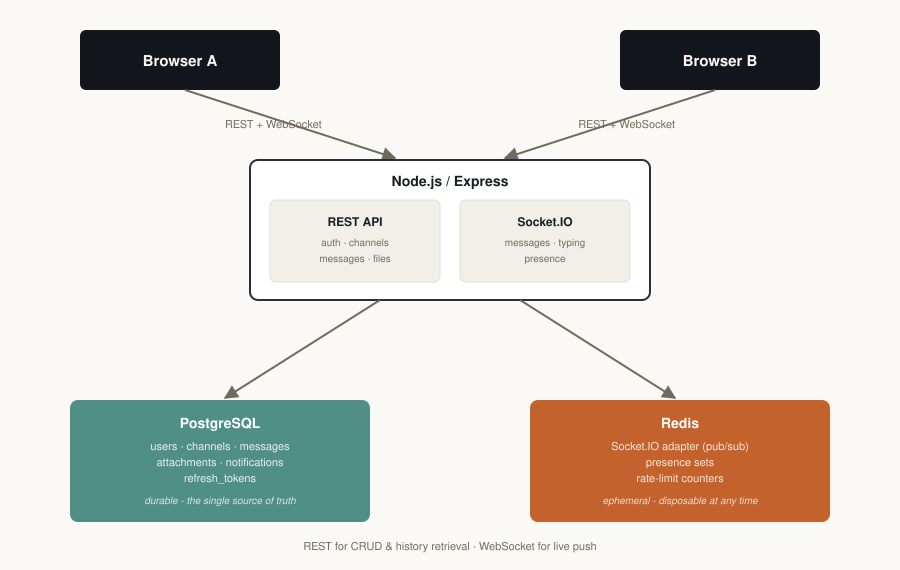

# Team Chat


A real-time team chat application: WebSocket messaging, Redis-backed presence and rate limiting, PostgreSQL storage, JWT auth with revocable sessions, notifications, and file sharing.

It is built to actually run: an automated integration suite exercises the real stack (real Postgres, real Redis, real sockets), and the app has been deployed and exercised on a real VPS behind nginx and a Cloudflare Tunnel.

For how it's built and why (data flow, event/API reference, trade-offs), see [ARCHITECTURE.md](ARCHITECTURE.md).



## Features

- [x] WebSocket messaging (Socket.IO): text and file messages, delivered live
- [x] Redis: Socket.IO adapter (cross-instance broadcast), presence, rate-limit storage
- [x] PostgreSQL: users, channels, messages, attachments, notifications
- [x] JWT auth: short-lived access tokens + DB-backed, revocable refresh tokens
- [x] Presence (online/offline), correct across multiple tabs and devices per user
- [x] Typing indicators
- [x] Notifications: live push if online, persisted for later if not
- [x] File sharing: upload, then attach to a message
- [x] Message history, cursor-paginated
- [x] Rate limiting: login, message send, uploads, and a general baseline

## Engineering highlights

- **Atomic presence transitions, with a debounce on top.** Online/offline detection uses small Lua scripts instead of check-then-set in application code, so two tabs connecting in the same millisecond can't both fire a duplicate "online" event. Going offline is delayed a few seconds and re-checked against the live socket set, so a brief reconnect doesn't flicker a user's status.
- **Multi-instance by design.** Presence broadcasts, the "is the recipient already viewing this channel" check, and room broadcasts all go through the Redis adapter or a Redis pub/sub channel, never in-memory state, even though the bundled Docker Compose setup runs one instance.
- **A real race condition, found by testing.** Socket event listeners are registered *before* the async room-join/presence setup, otherwise a message sent right on connect can be silently dropped. Details in [ARCHITECTURE.md](ARCHITECTURE.md#real-time-message-flow).
- **Revocable auth, not just stateless JWT.** Refresh tokens are stored hashed in Postgres, so logout truly invalidates a session.
- **Sockets re-authenticate.** Each socket carries a timer tied to its token's real expiry and must present a fresh token before it fires, or it's disconnected. The client schedules its refresh from that same expiry, so the mechanism holds at any configured token lifetime. See [Socket auth lifecycle](ARCHITECTURE.md#socket-auth-lifecycle).
- **Attachments are claimed, not trusted.** `message:send` never accepts a client-supplied file name, URL or MIME type. It atomically claims a row in an `uploads` table that exists only if this exact user uploaded that file and hasn't attached it elsewhere.
- **Uniqueness enforced by the database.** DM creation and registration are protected by a partial unique index (`channels.dm_key`) plus the `users.email`/`username` constraints, so duplicate state is impossible even under near-simultaneous requests.
- **Redis is treated as disposable.** Rate limiting fails open when Redis is unreachable, presence setup degrades independently of message delivery, and a background pass self-heals stale presence state. See [Redis outage behaviour](ARCHITECTURE.md#redis-outage-behaviour).
- **Integration tests against the real stack.** [`backend/test/integration.test.js`](backend/test/integration.test.js) runs two JWT-authenticated socket connections against real Postgres and Redis, with no mocks.

## Quick start (Docker Compose)

Prerequisite: Docker + Docker Compose.

```bash
docker compose up --build
```

This starts Postgres, Redis, and the backend on `http://localhost:4000` (Postgres runs `backend/src/db/schema.sql` automatically on first boot).

Then serve the frontend with any static file server:

```bash
cd frontend
python3 -m http.server 5500
# open http://localhost:5500
```

Register two accounts (one per browser window). Both land in `#general`, so you can test live messaging immediately.

## Manual setup (no Docker)

Prerequisites: Node.js 20+, PostgreSQL 14+, Redis 6+.

```bash
# 1. Database - create the role, then a database it owns, then grant it
#    rights on the public schema. PostgreSQL 15+ no longer gives non-owner
#    roles CREATE on the public schema, so without the last command
#    `npm run migrate` fails with "permission denied for schema public".
psql postgres -c "CREATE USER chatuser WITH PASSWORD 'chatpass';"
psql postgres -c "CREATE DATABASE teamchat OWNER chatuser;"
psql teamchat -c "GRANT ALL ON SCHEMA public TO chatuser;"
# (needs superuser rights, e.g. `sudo -u postgres psql ...` on Linux)

# 2. Backend
cd backend
cp .env.example .env    # edit DATABASE_URL / REDIS_URL if needed
npm install
npm run migrate         # applies schema.sql
npm start               # http://localhost:4000

# 3. Frontend (separate terminal)
cd frontend
python3 -m http.server 5500   # http://localhost:5500
```

Redis just needs to be running (`redis-server`) and reachable at the `REDIS_URL` in your `.env`.

## Verification

| Layer | What was checked | Result |
|---|---|---|
| Automated (local) | 49 integration checks against the real stack: live delivery, presence, notifications, file upload, attachment ownership, socket re-authentication, database race-safety, rate limiting, token revocation | Pass |
| Browser (local, Docker Compose) | Two windows, one account each: live messages, typing indicator, offline status, live DM, file preview, rate-limit error | Pass |
| Real server (VPS, 2026-09-29) | Containers healthy, `/health` reports Redis up, HTTPS via Cloudflare Tunnel, two accounts registered, messages exchanged live | Pass |

Run it yourself:

```bash
curl http://localhost:4000/health
cd backend && npm run test:integration
```

The step-by-step manual pass, including the parts only a human eye can check, is in [CHECKLIST.md](CHECKLIST.md).

### Details

**Local browser pass.** Done against the Docker Compose stack, before the latest security/reliability changes. Since then the Socket.IO client is served by the backend instead of a public CDN, and socket re-authentication is scheduled from the token's real expiry. [CHECKLIST.md](CHECKLIST.md) lists these plus two new manual checks (a disallowed file extension rejected in the upload UI; a socket surviving past 15 minutes on the re-auth lifecycle), queued for the next browser pass.

**Real-server deployment.** The stack was deployed on a VPS to confirm it runs outside a development machine, served over HTTPS through a Cloudflare Tunnel and nginx. This was a verification deployment, not a maintained production service, so it may not stay online. The integration suite and the remaining browser, Redis-outage and reboot checks are queued for the server environment. The layout is described in [Deployment topology](ARCHITECTURE.md#deployment-topology-as-verified).

## Project structure

```
team-chat-app/
├── LICENSE
├── docker-compose.yml
├── README.md
├── ARCHITECTURE.md
├── CHECKLIST.md
├── docs/
│   └── architecture.svg
├── backend/
│   ├── package.json
│   ├── .env.example
│   ├── .nvmrc
│   ├── Dockerfile
│   ├── src/
│   │   ├── server.js         # HTTP + Socket.IO bootstrap
│   │   ├── app.js            # Express app, middleware, route mounting
│   │   ├── config/           # env, PostgreSQL pool, Redis clients
│   │   ├── db/               # schema.sql + migration runner
│   │   ├── middleware/       # JWT auth, rate limiting, error handling
│   │   ├── routes/           # REST endpoints (auth, users, channels, messages, files, notifications)
│   │   ├── services/         # token / presence / notification logic, shared by REST and sockets
│   │   └── sockets/          # Socket.IO auth + connection wiring + event handlers
│   └── test/
│       └── integration.test.js
└── frontend/
    ├── index.html
    ├── css/style.css
    └── js/
        ├── api.js            # REST client + token storage/refresh
        ├── socket.js         # Socket.IO client wrapper
        └── app.js            # UI state, rendering, event wiring
```

## Configuration

See [`backend/.env.example`](backend/.env.example) for the full list with defaults: database/Redis URLs, JWT secrets and expiry, CORS origin, upload limits, and rate-limit thresholds.

The development defaults in `docker-compose.yml` (JWT secrets, database password, `CLIENT_ORIGIN`) are placeholders. Replace them for any real deployment and never commit the real values.

## Design decisions

- **Plain JavaScript, no build step.** `node src/server.js` is always enough to run the backend. The frontend has no bundler and loads the Socket.IO client from the backend itself.
- **Channels instead of a workspace layer.** Just channels (public, private, or DM) and their members. Team collaboration is expressed through shared channels rather than a multi-tenant workspace model, which would add real complexity without changing any of the core capabilities.
- **Integration-level tests.** Coverage runs against the real stack rather than isolated units. Message editing/deletion and infinite-scroll pagination in the UI are intentionally out of scope; the full list is in [Known limitations](ARCHITECTURE.md#known-limitations).

## Author

Built by [Majid Sattari](https://github.com/MajidLabs), full-stack developer.

## License

[MIT](LICENSE)
